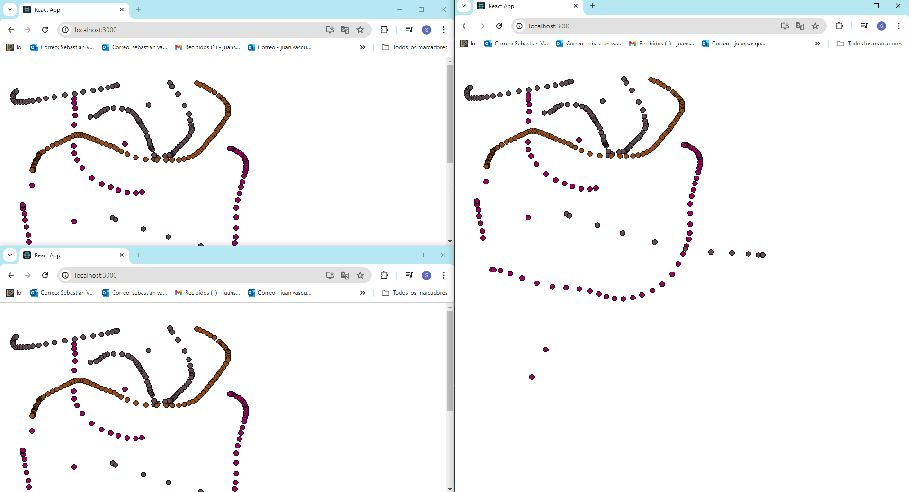

# MultiUserBoard

The project is a multiuser drawing board made up of two applications: one serves as the frontend and the other as the backend (API) built with Spring Boot. The backend includes two endpoints: one (GET) that returns a list of drawing actions, and another (POST) that receives and stores a new drawing action. The frontend, developed in React JS, displays a board where users can draw circles by clicking. Being multiplayer, it can run in multiple browsers at once, enabling users to see changes in semi-real-time.

### Features
+ **Draw**: You can draw consecutive circles using the mouse click.

## Getting Started
Download the project from 
[the repository.](https://github.com/Sebasvasquezz/MultiUserBoard.git)

You can also clone the file using the following command.

```
git clone https://github.com/Sebasvasquezz/MultiUserBoard.git  
```

### Prerequisites

* [Maven](https://maven.apache.org/): Automate and standardize the life flow of software construction

* [Git](https://www.git-scm.com/): Decentralized Configuration Manager

* [Node](https://nodejs.org/en/): A JavaScript runtime built on Chrome's V8 engine, enabling server-side scripting and development of scalable network applications.

### Installing
1. Maven
    * Download Maven in http://maven.apache.org/download.html
    * You need to have Java installed (7 or 8)
    * Follow the instructions in http://maven.apache.org/download.html#Installation

2. Git
    * Download git in https://git-scm.com/download/win
    * Follow the instructions in https://git-scm.com/book/en/v2/Getting-Started-Installing-Git

3. Node
    * Download Node in https://nodejs.org/en
    * Follow the instructions in https://nodejs.org/en/learn/getting-started/how-to-install-nodejs

### Installing

Once you have the cloned project in your repository. Follow the steps below to launch the program successfully.

#### Run BackEnd Spring-boot

1. Open a terminal and enter the folder where I clone the repository and enter the BoardSpring folder.

2. Use the following command to removes files generated in previous builds, compiles the code and packages the project into a JAR or WAR file ready for distribution.
    ```
    mvn clean package
    ```
3. Now you can run the project using the following command.

    ```
    mvn spring-boot:run
    ```

#### Run FrontEnd React Js

1. Open a terminal and enter the folder where I clone the repository and enter the BoardReact folder.

2. Use the following command to install dependencies
    ```
    npm install
    ```
3. Now use the following command start proyect

    ```
    npm start
    ```

4. Now open a browser and go to the following [link](http://localhost:3000/) to start drawing:



## Proyect Structure

### Run BackEnd Spring-boot

- BoardApplication: Main application class for the Spring Boot application.

- ClickController: REST controller for handling mouse click data.

- Click: Represents a mouse click data object.

### Run FrontEnd React Js

#### App:

- Contains the global state of the application (clicks and color).
- Renders ActionFetcher and Canvas, passing them necessary functions and data as props.

#### ActionFetcher:

- Uses useEffect to execute fetchActions() every second using setInterval.
- fetchActions() makes a GET request to the server to fetch drawing actions.
- Updates the actions state in App using setActions.

#### Board:

- Uses useRef to create references to containerRef (the canvas container) and p5InstanceRef (the p5 instance).
- Defines sketch to configure and draw on the canvas.
- useEffect initializes the p5 instance and associates it with containerRef when the component mounts.
- Another useEffect handles redrawing actions when actions change.
- drawAction draws a circle on the canvas based on received actions.

#### Server (API):

- There are two endpoints:
  - /clicks (GET): Returns a list of drawing actions.
  - /clicks (POST): Receives a new drawing action and stores it.


## Architectural Design


### Data Flow

#### Initialization:

- App mounts ActionFetcher and Canvas.
- ActionFetcher starts making GET requests to the server every second to update actions.

#### Drawing:

- When the user clicks on the canvas, Canvas creates a drawing action and sends it to the server via a POST request.
- drawAction in Canvas immediately draws the action.

#### Update:

- ActionFetcher periodically fetches actions from the server and updates the actions state in App.
- Whenever actions updates, Canvas clears and redraws all actions on the canvas.

## Built with

* [Maven](https://maven.apache.org/) - Dependency management
* [Node](https://nodejs.org/en/) - JavaScript runtime for building scalable network applications.

## Authors

* **Juan Sebastian Vasquez Vega**  - [Sebasvasquezz](https://github.com/Sebasvasquezz)

## Date

June 29, 2024

## License

This project is licensed under the GNU License - see the [LICENSE.txt](LICENSE.txt) file for details.